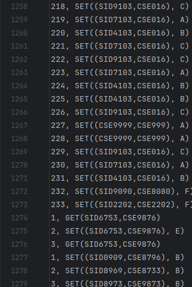

# Data Synchronization Across Heterogeneous Systems(NoSQL Endterm)
### Team Members
1. **Keshav Chandak(IMT2021003)**
2. **Sunny Kaushik(IMT2021007)**
3. **Muteeb Sheikh(IMT2021008)**
4. **Rishi Nelapati(IMT2021076)**

In  this project we have demonstrated the concepts of data integration and synchronization across heterogeneous systems mainly MongoDB, Pig and MySQL, utilising student records file, which contains student id, course id and grade for each student.

## Introduction

The project focuses on designing and implementing a distributed NoSQL triple store that manages subject-predicate-object triples. The system must support query, update, and merge operations to ensure efficient data storage, retrieval, and synchronization across multiple servers. The database taken into consideration are MongoDB, Pig and MySQL.

# Project Folder Structure and Code Overview

## Folder Structure Description
This project is organized into a directory structure designed to support a distributed data synchronization system across heterogeneous databases. The structure includes operation logs (`oplogs`), data files (`pig`), and Java source code (`src/main/java`). Below is an overview:

- **`oplogs`**: Contains individual operation log files for different systems:
  - `oplog.hive`: Log file for Hive operations.
  - `oplog.mongo`: Log file for MongoDB operations.
  - `oplog.pig`: Log file for Pig operations.
  - `oplog.sql`: Log file for SQL-based systems (e.g., PostgreSQL/MySQL).

- **`pig`**: Directory for Pig-related data:
  - `pig_data.csv`: Data file used.

- **`src/main/java`**: Contains Java source files implementing the core logic:
  - `HiveSystem.java`: Manages Hive database interactions (functionality described below).
  - `MongoSystem.java`: Handles MongoDB operations (follows a similar structure to `HiveSystem.java`).
  - `PigSystem.java`: Interfaces with the Pig system (follows a similar structure to `HiveSystem.java`).
  - `SQLSystem.java`: Manages SQL database operations (follows a similar structure to `HiveSystem.java`).
  - `Main.java`: Entry point of the application.
  - `Operation.java`: Defines operation-related logic.
  - `OperationLog.java`: Manages the operation log functionality.
  - `PigRunner.java`: Executes Pig scripts or workflows.
  - `SyncAppGUI.java`: Provides a graphical user interface for synchronization.
  - `SyncClient.java`: Implements client-side synchronization logic.
  - `SyncServer.java`: Handles server-side synchronization.
  - `SystemInterface.java`: Defines a common interface for all systems.
  - `TestCaseExecutor.java`: Executes test cases for validation.

The structure supports modularity, with separate files for each system, synchronization components, and testing, ensuring scalability and maintainability. The `HiveSystem.java`, `MongoSystem.java`, `PigSystem.java`, and `SQLSystem.java` files share a similar structure, implementing the `SystemInterface` to handle database-specific operations like `set`, `get`, and `merge`, with each maintaining its own operation log.

## Folder Structure Image


## CRUD Operations in Selected Data Systems

The following ways by which CRUD operations take place in each of the datastore that we are utilising in our project are as follows:-
### 1. MongoDB
- **Create**: `insertOne()`, `insertMany()` to add documents to a collection.
- **Read**: `find()` to retrieve documents with filters and projections.
- **Update**: `updateOne()`, `updateMany()` with `$set`, `$inc` to modify documents.
- **Delete**: `deleteOne()`, `deleteMany()` to remove documents based on criteria.

### 2. Pig
- **Create**: Load data using `LOAD` statement and define schemas using `AS`.
- **Read**: Use `FOREACH`, `FILTER`, and `DUMP` to process and view data.
- **Update**: Not directly supported; simulate by transformation and reloading.
- **Delete**: No native support; achieved by filtering out records and rewriting output.

### 3. MySQL
- **Create**: `INSERT INTO` to add records.
- **Read**: `SELECT` queries to fetch records.
- **Update**: `UPDATE` statement with `SET` clause to modify data.
- **Delete**: `DELETE FROM` with `WHERE` clause to remove specific records.

Here, only reading and updating are relevant for the scope of the project.

## MongoSystem.java Functionality
The `MongoSystem.java` class facilitates interaction with the database for managing student course grades, implementing the `SystemInterface`. The `set` method inserts or updates a grade for a given student ID and course ID in the `student_course_grades` table, logging the operation with a timestamp in `oplog.mongo`. The `get` method retrieves the grade for a specified student ID and course ID, returning "NULL" if no record exists. The `merge` method synchronizes the MongoDB system with another system by reading the other system's operation log (e.g., `oplog.pig`), extracting "SET" operations, and applying them to the MongoDB database using the `set` method, ensuring data consistency across systems.

The similar funcitonality is written in case of `PigSystem.java` and `SQLSystem.java`.

## Getting Started

### Installing

* Install the Intellij IDEA 
* Download the zipped folder from the github : [https://github.com/MutantShakes/NoSQL_End_Term](https://github.com/MutantShakes/NoSQL_End_Term/tree/main)


## Executing Program
Follow these step-by-step instructions to execute the program from the root directory:

- Navigate to the root directory of the project.
- Run `./run-server.sh` to start the server, which initializes the synchronization backend.
- Run `./run-app.sh` to launch the graphical user interface (GUI), providing a visual interface for interacting with the system.
- To create a new client with a unique client ID, run `./run-app.sh` again; each execution generates a new client instance with a distinct identifier for distributed 


Now the GUI of the applicaion will be launched and will be shown as below:


Now if multiple clients want to access the system then we need to execute:
```
./run-app.sh
```
The above command needs to be executed that many times as many number of clients are required.


`Caution` : Now there might be cases when the user of the application has forgot to start the mongoDB server in that case an error is shown on the GUI.


**Note:** Due to Hive issues as discussed by professor and TAs, and due to random errors, we had considered not to move ahead with it. Rest of the codes are working, and is completing the scope of the project.

## Demonstrating Set, Get, and Merge Functionalities

This section showcases the functionality of the `set`, `get`, and `merge` methods implemented in `MongoSystem.java` (with similar implementations in `PigSystem.java`, and `SQLSystem.java`) using the GUI launched via `./app.sh`.

- **Set Functionality**: The `set` method allows users to insert or update a grade for a specific student ID and course ID. Through the GUI, users input the student ID, course ID, and grade, which are then saved to the `student_course_grades` table in the database and logged in `oplog.mongo`.
  - **Screenshot**:  
    

- **Update Functionality**: The `update` method updates the grade for a given student ID and course ID from the database. In the GUI, users enter the student ID and course ID, and the updated grade.
  - **Screenshot**:  
    


- **Merge Functionality**: The `merge` method synchronizes the Mongo system with another system (e.g., Pig and SQL) by applying operations from the other system's log (e.g., `oplog.mongo`). The GUI allows users to select a system to merge with, ensuring data consistency across distributed systems.
  - **Screenshot**:  
    
    The above image shows that from the Mongo Database logs, system reads it and updates it in the Pig and SQL system when we execute the Merge operation one by one for each database.

## Showing logs registered
This section shows the logs registered from the oplog.mongo and the message displayed on the server side.



## Explanation of the mathematical properties of the merge operations

The below images(Image-1 to Image-9) explain all the properties of nosql databases that are being utilised in unison, like associativity, commutativity and idempotence. For simplicity, we consider two datastores Mongo and SQL as example below.
<div align="center">
  
  <p style="font-size:18px;"><strong>Image-1</strong></p>
</div>

<div align="center">
  
  <p style="font-size:18px;"><strong>Image-2</strong></p>
</div>

<div align="center">
  
  <p style="font-size:18px;"><strong>Image-3</strong></p>
</div>

<div align="center">
  
  <p style="font-size:18px;"><strong>Image-4</strong></p>
</div>

<div align="center">
  
  <p style="font-size:18px;"><strong>Image-5</strong></p>
</div>

<div align="center">
  
  <p style="font-size:18px;"><strong>Image-6</strong></p>
</div>

<div align="center">
  
  <p style="font-size:18px;"><strong>Image-7</strong></p>
</div>

<div align="center">
  
  <p style="font-size:18px;"><strong>Image-8</strong></p>
</div>

<div align="center">
  
  <p style="font-size:18px;"><strong>Image-9</strong></p>
</div>
The images represent the following: 

1. **Image-1, Image-2 and Image-3** are update operation on MongoDB datastore, where we set the grades A,B and C for (SID1000,CSE001), (SID1000,CSE002) and (SID1000,CSE003) Student ID, Course ID pairs respectively.    
2. **Image-4** is update operation on MySQL datastore, where we set grade E for (SID1000, CSE003) respectively.      
3. **Image-5** shows the merge of MongoDB operation on SQL, where the states of each operation in MongoDB is merged with that of MySQL.   
4. **Image-6 and Image-7** show that there are same states in MongoDB and MySQL datastore.   
5. Now, we again repeat the above steps, and then merge SQL contents with MongoDB instead. now, we can see that the contents of `MongoDB.merge(SQL)` is different from that of `SQL.merge(MongoDB)`. 

## Properties of `merge()` Operation

The `merge()` operation in our datastore simulation exhibits the following properties:

- **Associativity** ✅  
  Merging operations in grouped sequences yield the same result regardless of grouping:  
  `(A.merge(B)).merge(C) == A.merge(B.merge(C))`

  This is because the states of C is reflected upon B, and then upon A, along with uncommon states of B. So, the merge() remains associative.

- **Idempotence** ✅  
  Merging the same data repeatedly does not alter the result beyond the first merge:  
  `A.merge(A) == A`

  The states of A remain the same after merging with itself.

- **Commutativity** ❌  
  The order of merging affects the final result:  
  `A.merge(B) != B.merge(A)`
  This behavior is illustrated above, using MongoDB and MySQL update operations. The results of `SQL.merge(MongoDB)` and `MongoDB.merge(SQL)` differ, highlighting non-commutativity.
    
Since, not all the properties are satisfied by the merge() function, it is not necessary that the datastores will reach the same states at all times. It depends upon case-by-case basis. 

Thus, the **convergence** is not necessary.


## Authors and Contributions

1. **Keshav Chandak (IMT2021003)** - Contributed in coding part of Java interfaces, documentation regarding the properties of merge operations like associativity, commutativity, idempotence, and helped in formulating the GUI logic. The total contribution in terms of percentages would be **24%**.
2. **Sunny Kaushik (IMT2021007)** - Contributed in documentation regarding the details of the project like the oplogs, project structure and Pig setup. Then, shifted to docker due to the image containing derby, hadoop, and java configurations, which simplified the issue. The total contribution in terms of percentages would be **24%**.
3. **Muteeb Sheikh(IMT2021008)** - Contributed in merging the whole project, and created GUI along with the logic and coding of timestamp ordering and logging for each operations. Took the lead in project development lifecycle. The total contribution in terms of percentages would be **30%**. 
4. **Rishi Nelapati (IMT2021076)** - Contributed with documentation and MySQL operations code, and created sample testcases for operations on each datastore. The total contribution in terms of percentages would be **22%**. 


## Acknowledgments

We acknowledge the help of Prof. Vinu E Venugopal for helping us with the clarity of the project, and helping us understand the approximate workflow of the project. It was an incredible project to work with, and helped us understand the working of each datastore, along with the intricate details for each of Pig, MySQL and MongoDB.

